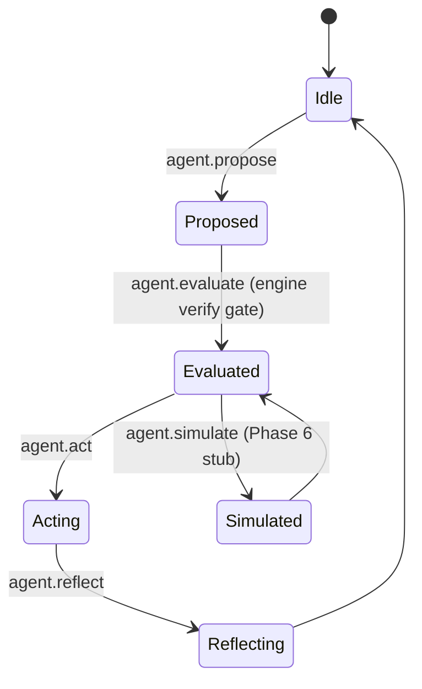

# Constitutional Agent Shell — architecture

This document is the **application** architecture for AO. It sits **above** the engine stack described in [`ARCHITECTURE.md`](../ARCHITECTURE.md) and uses the **kernel boundary** in [`ddf-core/KERNEL_API_MAP.md`](../ddf-core/KERNEL_API_MAP.md).

## 1. System map (Meadows)

| Stock | Location | Notes |
|-------|-----------|-------|
| Agent memory (durable) | `AO/ledger/events.jsonl` | Append-only, hash-chained; **application** system of record |
| Engine doctrine + constitution | Engine `doctrine.toml`, `constellation.toml` | **Read** for `doctrine_hash` in shell entries; never edited here |
| Engine main ledger | Engine `ledger/events.jsonl` | Phantom-only; records **engine** rituals |
| Advisory stream | Engine `advisories/stream.jsonl` | GHOST-only |
| Operator intent | Ceremony files, CLI args | Ephemeral unless copied into ledger fields |

| Flow | Path |
|------|------|
| Proposal → evaluate → act → reflect | Shell rituals append `agent.*` events in order |
| Engine health | `phantom verify` (via `ca_shell::kernel::engine_verify`) |
| Conscience | `python -m ghost advise` (via `engine_advise`) |
| Future transport | Hyperion carries **opaque envelopes** only; no sovereign side effects without Phantom |

## 2. Agent lifecycle (high level)

## 3. Proposal → ritual → commit

1. **Propose** — append `agent.propose` to the shell ledger (no engine mutation).
2. **Evaluate** — run **engine verify**; if OK, append `agent.evaluate` binding the proposal to a verdict.
3. **Act** — append `agent.act`; if `effect_class = external`, require **ceremony file** first, then engine verify, then ledger append (I7 ordering: intent on shell ledger before any external tool is allowed to proceed in orchestrators built atop this library).
4. **Reflect** — append `agent.reflect` closing the learning loop (Constellation §6).

**Commit** means: the event is **hash-chained** on `AO/ledger/events.jsonl` using `ddf::ledger` / `ddf::canonical` (same canonical rules as the engine ledger).

## 4. Advisory loop

- The operator (or CI) runs **`ca-shell engine-advise`** after material engine ledger changes.
- GHOST rules **R001–R007** fire against the **engine** ledger tail; advisories reference `ledger_tail_hash` per [`advisories/SPEC.md`](../advisories/SPEC.md).
- The shell **does not** auto-consume advisories for authorization; **authorization** is ceremony + shell rituals. Advisories inform humans and audits.

## 5. Ledger-backed memory model

- **Short-term** state in orchestrators is allowed only as a **cache of ledger tail**; rebuild from `AO/ledger/events.jsonl` on restart.
- **Long-term** truth is the shell ledger line for each ritual.

## 6. Operator approval model

- **Ledger-only** acts: logged with `effect_class = ledger_only`; still require successful engine verify when the ritual specifies it (evaluate, act, reflect, simulate stubs).
- **External** acts: require a ceremony file containing a line **`OPERATOR_APPROVED=1`** (see `SECURITY_MODEL.md`).

## 7. Doctrine and invariant enforcement

- **Engine** invariants I1–I8 are enforced by Phantom/GHOST as today.
- **Shell** enforces: (a) hash-chained shell ledger writes, (b) `doctrine_hash` on each line from **engine** `doctrine.toml` (binds application history to a known safety envelope), (c) external-act ceremony gate.

## 8. Simulation hooks (Phase 6)

- `agent.simulate` appends a **stub** line referencing `ddf-core/simulation/` placeholders (`ritual_dryrun`, `ledger_replay`, …). See [`PHASE6_MIGRATION.md`](./PHASE6_MIGRATION.md).

## 9. Hyperion-ready transport boundaries

- Treat outbound payloads as **content-addressed blobs** under a future `AO/transport/outbox/` (not implemented in v0.1.0).
- Transport workers must **not** write the shell ledger; only **`ca-shell` rituals** (or future Phantom-registered app executors) append events.

## 10. Components

| Component | Role |
|-----------|------|
| `ca-shell` CLI | Operator entry; dispatches engine verify/advise + shell rituals |
| `ca_shell` library | Deterministic ledger append helpers |
| `python/ao_shell` | Optional subprocess wrapper for CI |
