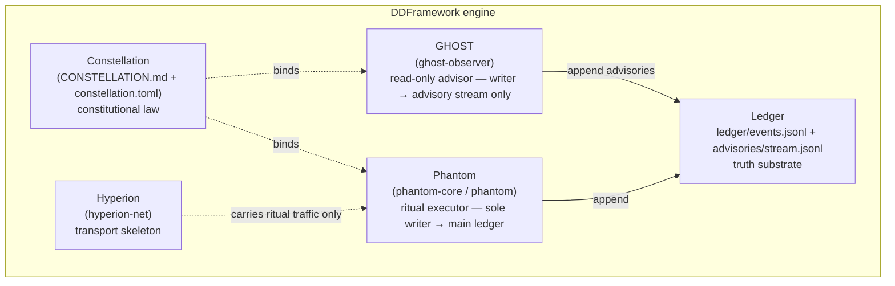
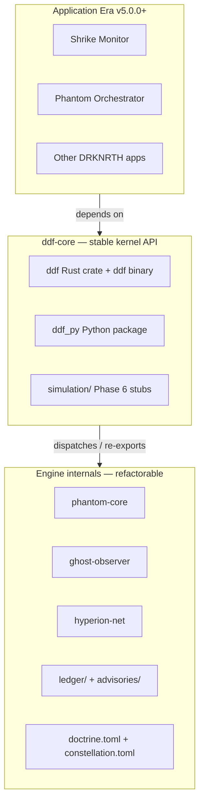
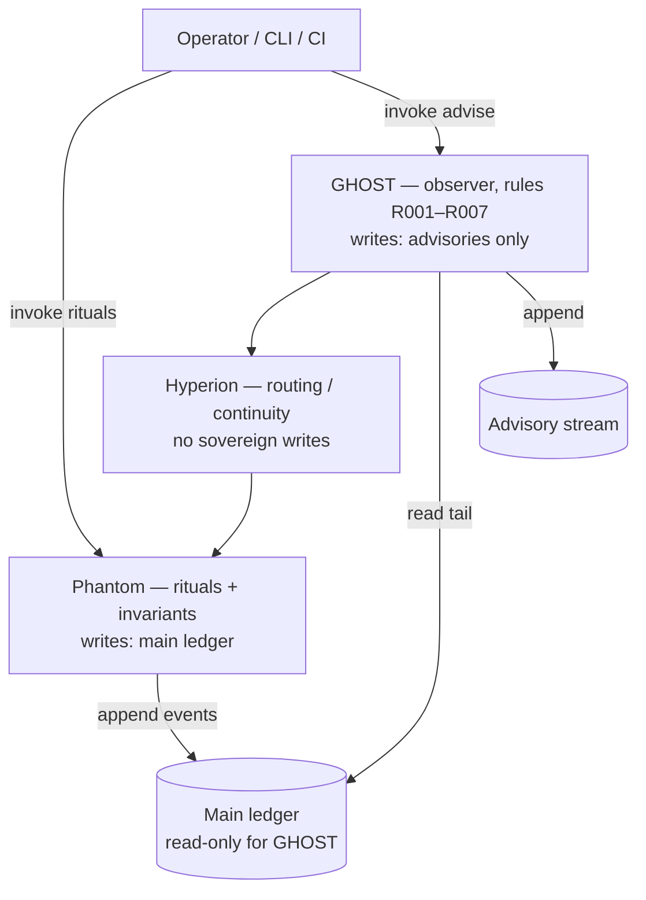
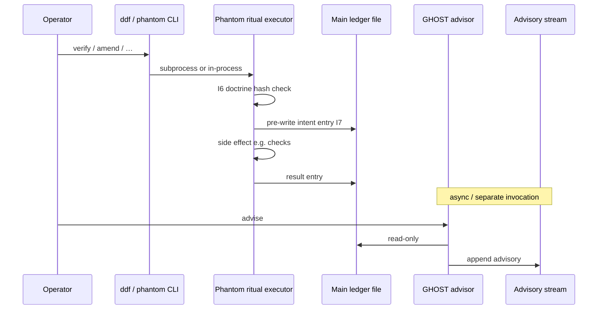
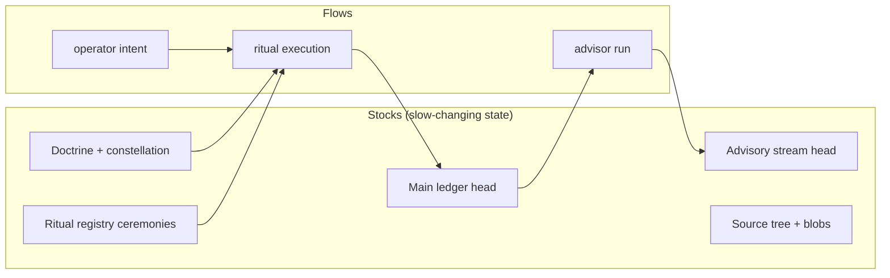

# DDFramework — layer visuals

This page collects **diagrams** for the engine stack: five layers, kernel
boundary, data/control paths, and governance. Use it before structural
changes.

**Visio:** this repository does not ship `.vsdx` (binary format). You can:

1. **Import SVG** — open [`images/ddf-layers-stack.svg`](./images/ddf-layers-stack.svg) in Visio (**Insert → Pictures** from file) or **Inkscape**, then ungroup/edit.
2. **Copy Mermaid** — paste into [Mermaid Live Editor](https://mermaid.live), export **SVG** or **PNG**, then import into Visio.
3. **GitHub / VS Code** — render this Markdown natively where Mermaid is enabled.

**Mechanical names:** see [`../GLOSSARY_ENGINE_NAMES.md`](../GLOSSARY_ENGINE_NAMES.md).

---

## 1. Five engine layers (what “is” DDFramework)

Per [`DDFRAMEWORK.md`](../DDFRAMEWORK.md): Phantom, Constellation, GHOST,
Hyperion, Ledger — together they *are* the engine.



**Write boundaries (critical):**

- **Main ledger** (`ledger/events.jsonl`): **Phantom only**.
- **Advisory stream** (`advisories/stream.jsonl`): **GHOST only**.
- **Hyperion:** transport only; no sovereign ritual side effects alone.

---

## 2. Kernel boundary (Application Era → `ddf-core` → internals)



---

## 3. Nested stack (operator mental model from ARCHITECTURE)

GHOST “wraps” the fabric; fabric wraps Phantom — **read path** from
outside in; **writes** still follow Phantom/GHOST rules above.



---

## 4. Control flow vs data flow (one ritual)



---

## 5. ASCII — five layers + kernel (print / email friendly)

```
                    ┌─────────────────────────────┐
                    │   Applications (v5+)      │
                    │   depend on ddf API only  │
                    └──────────────┬────────────┘
                                   │
                    ┌──────────────▼──────────────┐
                    │  ddf-core (kernel)        │
                    │  ddf bin / ddf crate /    │
                    │  ddf_py                    │
                    └──────────────┬────────────┘
         ┌─────────────────────────┼─────────────────────────┐
         │                         │                         │
┌────────▼────────┐       ┌─────────▼─────────┐       ┌────────▼────────┐
│  Constellation  │       │     Phantom      │       │     GHOST       │
│  constitution   │       │  ritual executor │       │  read-only     │
│  (prose + TOML) │       │  main ledger ✎  │       │  advisor ✎ adv  │
└────────┬────────┘       └─────────┬─────────┘       └────────┬────────┘
         │                          │                          │
         │                 ┌────────▼────────┐                 │
         │                 │    Hyperion     │                 │
         │                 │  transport C/R  │                 │
         │                 └────────┬────────┘                 │
         │                          │                          │
         └──────────────────────────┼──────────────────────────┘
                                    │
                    ┌───────────────▼────────────────┐
                    │  Ledger (truth substrate)      │
                    │  events.jsonl | stream.jsonl   │
                    └────────────────────────────────┘

  ✎ = sole append authority for that file family (I1, I7, I8)
```

---

## 6. Stocks and flows (Meadows, simplified)



---

## Files in this visual pack

| File | Purpose |
|------|---------|
| This Markdown | Mermaid + ASCII; version with repo |
| [`images/ddf-layers-stack.svg`](./images/ddf-layers-stack.svg) | Single-page stack; import into Visio / slides |

If you want a second SVG (sequence-style or governance-only), open an
issue or extend this folder under the same linking rule from
[`README.md`](../README.md).
